<!-- ═══════════════════ HERO ═══════════════════ -->

<p align="center">
  
</p>

<p align="center">
  <samp>
    <a href="#about">ABOUT</a> &nbsp;·&nbsp;
    <a href="#specialization">SPECIALIZATION</a> &nbsp;·&nbsp;
    <a href="#experience">EXPERIENCE</a> &nbsp;·&nbsp;
    <a href="#stack">STACK</a> &nbsp;·&nbsp;
    <a href="#telemetry">TELEMETRY</a> &nbsp;·&nbsp;
    <a href="#contact">CONTACT</a>
  </samp>
</p>

<p align="center">
  <a href="https://yashsachan.com/">
    
  </a>
</p>

<p align="center">
  <a href="https://yashsachan.com/"></a>
  <a href="https://www.linkedin.com/in/yashsachan321/"></a>
  <a href="https://github.com/CyberlordYash"></a>
  <a href="https://leetcode.com/u/CyberlordYash/"></a>
  <a href="https://www.codechef.com/users/CyberlordYash"></a>
  <a href="mailto:yashsachan321@gmail.com"></a>
</p>


<!-- ═══════════════════ 01 · ABOUT ═══════════════════ -->
<a id="about"></a>

## <samp>[ 01 ]&nbsp;&nbsp;A B O U T</samp>

<samp>NOT A STUDIO — JUST ME.</samp>

I'm a backend engineer working where latency, concurrency, and correctness actually matter. Day to day that means **high-frequency trading infrastructure** at Zanskar Securities: Go services that ingest exchange feeds, stream them over WebSockets, and move orders through with minimal contention — and mentoring aspiring engineers on the side.

```go
package main

type Engineer struct {
    Role     string
    Location string
    Domain   string
    Focus    []string
    Stack    []string
    Solving  string
}

var yash = Engineer{
    Role:     "Analyst Software Engineer @ Zanskar Securities",
    Location: "Bengaluru, India",
    Domain:   "Fintech · Low-Latency Trading Systems",
    Focus:    []string{"Distributed Systems", "Concurrency", "Event-Driven Architecture", "Observability"},
    Stack:    []string{"Go", "gRPC", "NATS JetStream", "PostgreSQL", "Redis", "Next.js", "TypeScript"},
    Solving:  "Process market data fast, durably, and without dropping a single order.",
}
```

```text
[ CORE THREADS OF MY WORK ]

  01 ////   DISTRIBUTED SYSTEMS
  02 ////   PERFORMANCE ENGINEERING
  03 ////   CLOUD-NATIVE INFRA
  04 ////   2000+ DSA PROBLEMS SOLVED
```


<!-- ═══════════════════ 02 · SPECIALIZATION ═══════════════════ -->
<a id="specialization"></a>

## <samp>[ 02 ]&nbsp;&nbsp;S P E C I A L I Z A T I O N</samp>

```text
┌─ SPECIALIZATION ─────────────────────────────────────────────────────────┐
│                                                                          │
│   DISTRIBUTED   +   SYSTEMS   +   PERFORMANCE                            │
│                                                                          │
│   →  HIGH-THROUGHPUT      goroutines · channels · worker pools           │
│   →  EVENT STREAMING      NATS JetStream · durable, at-least-once        │
│   →  REAL-TIME FEEDS      batched WebSocket fan-out · market + trade     │
│   →  INFRA ENGINEERING    Docker · Kubernetes · GCP                      │
│   →  OBSERVABILITY        Prometheus · Grafana · Loki                    │
│                                                                          │
└──────────────────────────────────────────────────────────────────────────┘
```


<!-- ═══════════════════ 03 · EXPERIENCE ═══════════════════ -->
<a id="experience"></a>

## <samp>[ 03 ]&nbsp;&nbsp;E X P E R I E N C E</samp>

<samp>▾ &nbsp;JUL 2025 — PRESENT &nbsp;·&nbsp; ZANSKAR SECURITIES, BENGALURU</samp>

### Analyst Software Engineer

> Low-latency **Go** services built on goroutines, channels, and worker pools for high-frequency trading workloads. Designed batched **WebSocket** pipelines for real-time market and trade streaming, integrated **NSE, BSE, mutual fund & IPO** platforms (SOAP + Open APIs), and used **NATS JetStream** for durable event streaming. Core contributor to **Nubra**, an in-house trading platform — order management, portfolio tracking, live market feeds.

<samp>▾ &nbsp;JAN 2025 — JUN 2025 &nbsp;·&nbsp; ONEFINNET, NOIDA-NCR</samp>

### Software Engineering Intern

> Engineered concurrent **Go** backend services (**↑ 25% throughput**), built an internal chatbot with **Go + Azure AI** (**↓ 21% manual work**), and shipped **Next.js** features instrumented with **Grafana, Prometheus & Loki**.

<samp>▾ &nbsp;JUL 2024 — OCT 2024 &nbsp;·&nbsp; MODULUS TECHNOLOGIES LLP, REMOTE</samp>

### Software Engineering Intern

> Migrated a billing system from React to **Next.js** (**↓ 30% load time**) and built backend architecture on **PostgreSQL, FeathersJS & GCP**.


<!-- ═══════════════════ 04 · STACK ═══════════════════ -->
<a id="stack"></a>

## <samp>[ 04 ]&nbsp;&nbsp;S T A C K</samp>

<samp>LANGUAGES</samp><br>


<samp>BACKEND &amp; APIS</samp><br>


<samp>FRONTEND</samp><br>


<samp>DATA</samp><br>


<samp>DEVOPS &amp; OBSERVABILITY</samp><br>


<!-- ═══════════════════ 05 · TELEMETRY ═══════════════════ -->
<a id="telemetry"></a>

## <samp>[ 05 ]&nbsp;&nbsp;T E L E M E T R Y</samp>

<p align="center">
  
  
</p>

<p align="center">
  
</p>


<!-- ═══════════════════ 06 · CONTACT ═══════════════════ -->
<a id="contact"></a>

## <samp>[ 06 ]&nbsp;&nbsp;C O N T A C T</samp>

```text
LOCAL TIME   IST · UTC+05:30          STATUS   ● OPEN TO CONVERSATIONS
LOCATION     BENGALURU, INDIA         BEST AT  distributed systems · Go · latency work
```

<p align="center">
  <a href="mailto:yashsachan321@gmail.com"></a>
  <a href="https://www.linkedin.com/in/yashsachan321/"></a>
  <a href="https://yashsachan.com/"></a>
</p>

<p align="center">
  <samp><em>Code isn't just meant to run — it's meant to scale, stay observable, and survive Monday morning.</em></samp>
</p>

<p align="center">
  <samp>FOUNDATION DESIGNED FOR GROWTH</samp>
</p>
